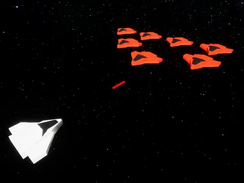

# GameForge

> A collection of games created from scratch using multiple game engines! Each game has its own unique gameplay mechanics and style, making them fun and engaging for players of all ages. Check out the individual game folders for more information on each game.”


## 🛠️ Build with
[](https://unrealengine.com/)


## 📷 Preview

#### Last Star (Space Shooter)



## 🚀 Getting Started


### 📋 Prerequisites

- Git
  1. [Set up Git.](https://docs.github.com/en/get-started/quickstart/set-up-git)
  2. Don't forget to [set up authentication to GitHub.com from Git](https://docs.github.com/en/get-started/quickstart/set-up-git#next-steps-authenticating-with-github-from-git) as well.

### ⚙️ Setup

*Optional: If you want to use a copy of this repository, you can fork it to your own GitHub account.*

0. **SELECT A PROJECT**: You can select a specific project to clone by selecting the branch in the dropdown menu in the top left corner of the repository. If you want to clone all the games, you can clone the `main` branch.
1. Above the list of files, click ↓Code.
2. Using HTTPS, under "Clone with HTTPS", click the clipboard icon.
3. In the terminal, change the current working directory to the location where you want the cloned directory to be made.
4. Clone the repository to your local machine.
   ```sh
   git clone <HTTPS_URL>
   ```

### 🖱️ Usage

- Feel free to use or modify the projects as you wish.
- If you want to use the code or assets in your own projects, please give credit to the original authors.


## 👤 Author

**J. Luis Arredondo (Retky)**
- GitHub: [@Retky](https://github.com/retky "J. Luis Arredondo GitHub")
- Twitter: [@RetkyFox](https://twitter.com/retkyFox "J. Luis Arredondo Twitter")
- LinkedIn: [Retky](https://www.linkedin.com/in/retky "J. Luis Arredondo LinkedIn")


## 🤝 Contributing

Contributions, issues, and feature requests are welcome! Feel free to get in touch with any issues or suggestions.
- 🐛 **Bug reports & issues:** Use [GitHub Issues](https://github.com/Retky/GameForge/issues "Bugs & Issues")
- 💡 **Suggestions:** Use [Github Discussions](https://github.com/Retky/GameForge/discussions "Suggestions")
- 🙋‍♀️ **General questions:** Use [Github Discussions](https://github.com/Retky/GameForge/discussions "General Questions")


## ✨ Show your support

Give a ⭐️ if you like this project!


## 📝 License

Copyright © 2023.

See [LICENSE](./LICENSE) for details.
